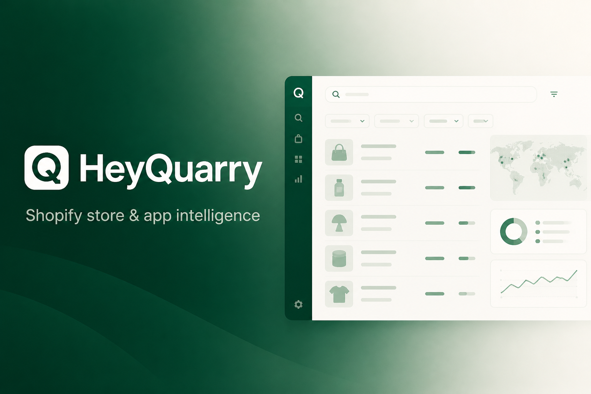
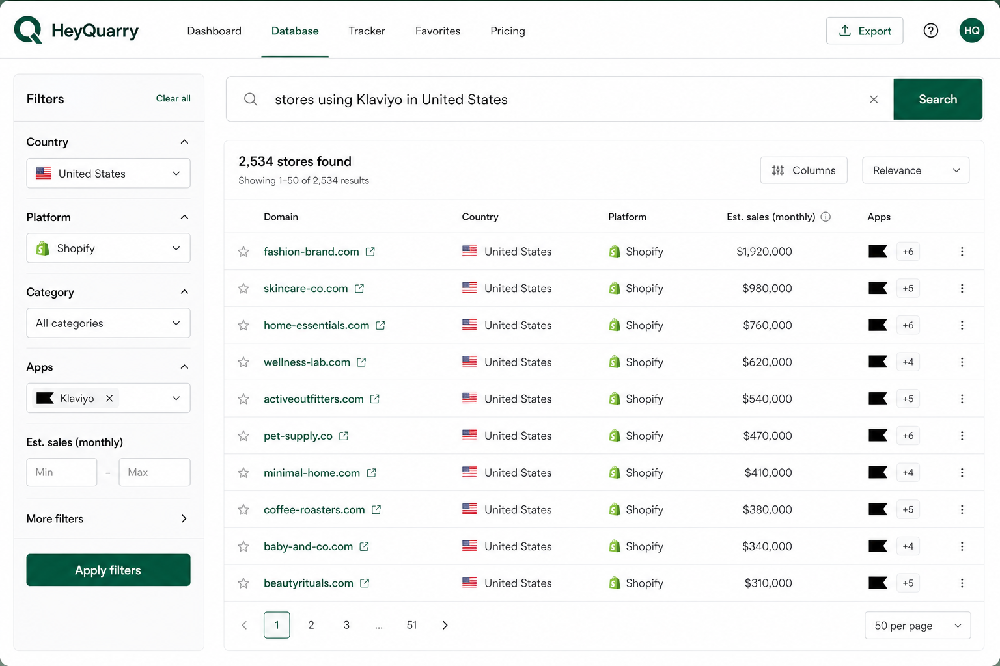

<p align="center">
  
</p>

<h1 align="center">HeyQuarry</h1>

<p align="center">
  <strong>Shopify store &amp; app intelligence for Grok</strong><br />
  Free store database · Research-grade firmographics · Hosted MCP
</p>

<p align="center">
  <a href="https://heyquarry.com"></a>
  <a href="https://github.com/xai-org/plugin-marketplace/pull/450"></a>
  <a href="https://heyquarry.com/privacy"></a>
  <a href="LICENSE"></a>
</p>

<p align="center">
  <a href="https://heyquarry.com">Website</a> ·
  <a href="https://heyquarry.com/#plans">Plans</a> ·
  <a href="mailto:support@heyquarry.com">support@heyquarry.com</a> ·
  <a href="https://github.com/xai-org/plugin-marketplace/pull/450">xAI marketplace PR</a>
</p>

---



## Why HeyQuarry

HeyQuarry is the business layer for Shopify apps — analytics, lifecycle email, cross-promotions, affiliates, and a **3.5M+ store & app catalog**.

This official Grok plugin exposes a **Research** surface over that catalog via hosted MCP:

| Capability | What you get |
|---|---|
| **Store search** | Domain, merchant name, country, platform, ranks, sales/visits estimates, categories, theme, plan, status |
| **App intelligence** | Name, description, reviews, rating, installs, categories, App Store URL, vendor geo |
| **Install overlap** | Domains that install a given Shopify app |
| **Market facets** | Countries, platforms, categories for exploratory research |

**Listing (Research)**  
*Free Shopify store database. Search stores by apps, niche, location, technology and more.*



## Free plugin scope (privacy-first)

Free responses return **firmographics and app metadata only**.

| Included | Never included on Free |
|---|---|
| Store & app firmographics | Emails |
| Installed **app names** | Phones |
| Ranks, geo, categories, tech | Social profiles |
| App ratings / installs | People / LinkedIn |

Contact enrichment, CSV export, Mailknit push, and related workflows live in the full HeyQuarry product on [Business+](https://heyquarry.com/#plans).

## Architecture

```text
┌─────────────────┐     HTTPS      ┌──────────────────────────────┐
│  Grok Build /   │ ──────────────► │  heyquarry.com/api/mcp       │
│  Grok Bot       │   MCP + key     │  Hosted catalog MCP          │
└─────────────────┘                 └──────────────┬───────────────┘
                                                   │
                                                   ▼
                                    ┌──────────────────────────────┐
                                    │  HeyQuarry catalog           │
                                    │  3.5M+ stores & apps         │
                                    └──────────────────────────────┘
```

- **MCP endpoint:** `https://heyquarry.com/api/mcp`
- **Auth:** `HEYQUARRY_API_KEY` (`hq_live_…`)
- **Skill:** [`skills/heyquarry/SKILL.md`](skills/heyquarry/SKILL.md)

### Tools

| Tool | Purpose |
|------|---------|
| `search_stores` | Full-catalog store search |
| `get_store` | Single store profile (no contacts) |
| `search_apps` | App catalog search |
| `get_app` | Single app profile |
| `list_app_installs` | Domains using an app |
| `search_facets` | Countries / platforms / categories |

## Quick start

1. Create a catalog API key in HeyQuarry (super-admin: `POST /api/admin/catalog-keys`).
2. Set `HEYQUARRY_API_KEY` to the returned `hq_live_…` value.
3. Install from the [Grok Build marketplace](https://github.com/xai-org/plugin-marketplace) once listed, or install directly:

```bash
grok plugin install ankit662002/heyquarry-grok-plugin --trust
```

Point MCP at the hosted server (see [`mcp.json`](mcp.json) / [`.mcp.json`](.mcp.json)):

```json
{
  "mcpServers": {
    "heyquarry": {
      "url": "https://heyquarry.com/api/mcp"
    }
  }
}
```

## Quotas & rate limits

| Plan | Records | Rate |
|------|---------|------|
| **Free** (`free_plugin`) | **10,000 lifetime** store/app/install rows | 60 req/min |
| **Business** (`business_plugin`) | Unlimited | 60 req/min |

Facets do not consume the lifetime record budget. When a Free key hits the cap, upgrade to a Business catalog key.

## Company & links

| | |
|---|---|
| **Product** | [heyquarry.com](https://heyquarry.com) |
| **Plans** | [heyquarry.com/#plans](https://heyquarry.com/#plans) |
| **Privacy** | [heyquarry.com/privacy](https://heyquarry.com/privacy) |
| **Support** | [support@heyquarry.com](mailto:support@heyquarry.com) |
| **Marketplace PR** | [xai-org/plugin-marketplace#450](https://github.com/xai-org/plugin-marketplace/pull/450) |
| **This repo** | [ankit662002/heyquarry-grok-plugin](https://github.com/ankit662002/heyquarry-grok-plugin) |

## Security & compliance notes for reviewers

- Hosted MCP only — no local code execution beyond the plugin skill/manifest.
- Remote source is SHA-pinned in the xAI catalog.
- Free responses are redacted for PII (emails, phones, socials, people).
- Open source under [MIT](LICENSE).

---

<p align="center">
  <sub>© HeyQuarry · Built for Shopify app teams · <a href="https://heyquarry.com">heyquarry.com</a></sub>
</p>
